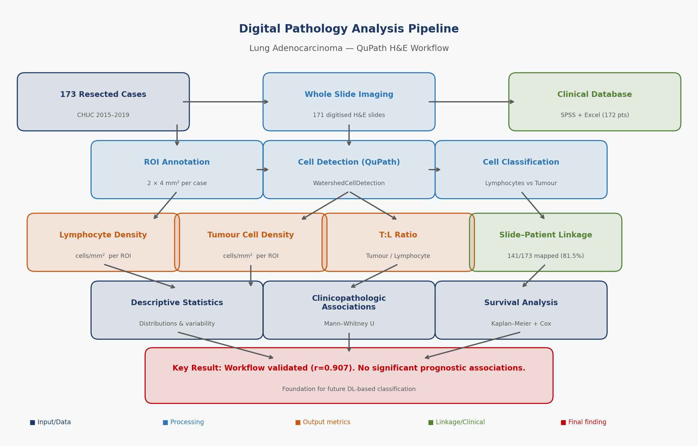
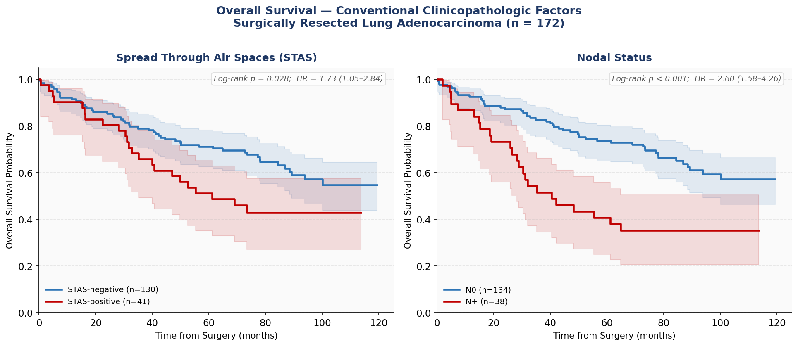
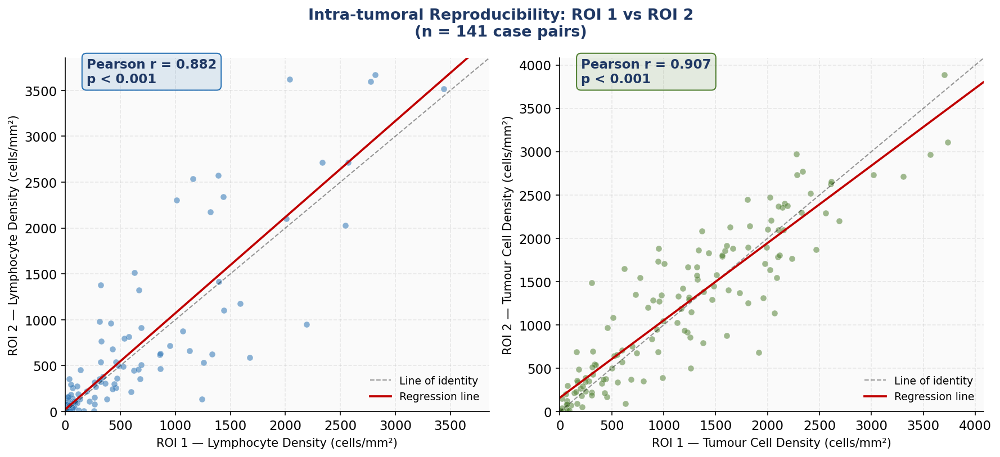
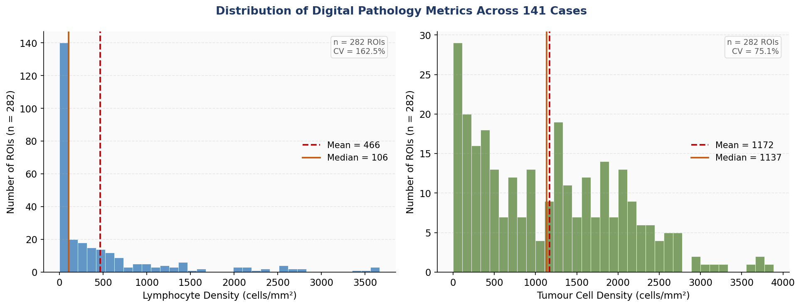
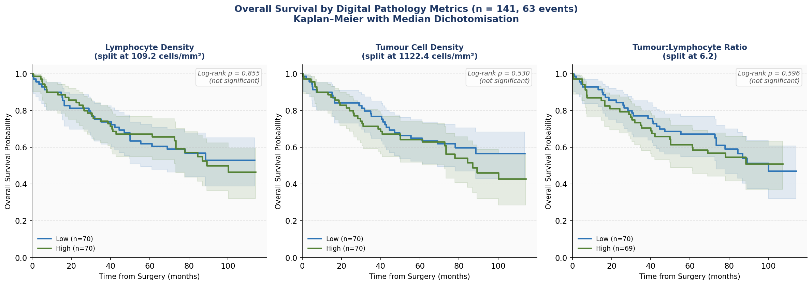

# Beyond Conventional Pathology: Quantitative Digital Morphology in Lung Adenocarcinoma

> **Author:** Vania Almeida  
> **Institution:** Department of Pathology, CHUC – Centro Hospitalar Universitário de Coimbra, Portugal  
> **Type:** Medical Doctoral Thesis  
> **Year:** 2025  

---

## Overview

This repository contains the complete computational analysis pipeline for a retrospective study of **172 surgically resected lung adenocarcinomas** (CHUC, 2015–2019). The project quantifies tumour cell density and lymphocyte density from routine haematoxylin & eosin (H&E) whole slide images using the open-source platform [QuPath](https://qupath.github.io/), and evaluates their prognostic value alongside established clinicopathologic factors.

The central question: **can quantitative features extracted from routine H&E slides improve risk stratification beyond conventional pathological staging?**

---

## Analysis Pipeline



---

## Key Results

### Chapter 2 — Conventional Prognostic Factors

Nodal positivity (pN+) was the dominant independent prognostic factor (multivariable HR = 3.12, 95% CI 1.50–6.50, p = 0.002; C-index = 0.670). STAS was significant in univariate analysis (HR = 1.73, p = 0.028).



| Variable | 5-yr OS (group 0) | 5-yr OS (group 1) | Log-rank p |
|---|---|---|---|
| STAS (neg vs pos) | 71.2% | 51.2% | **0.028** |
| pN (N0 vs N+)     | 73.7% | 40.7% | **< 0.001** |
| LVI (neg vs pos)  | 67.5% | 63.8% | 0.680 |
| VPI (neg vs pos)  | 75.6% | 58.9% | 0.073 |
| PD-L1 (<1% vs ≥1%)| 72.3% | 68.9% | 0.793 |

### Chapter 4 — Digital Pathology (QuPath)

The workflow was successfully validated across 171 whole slide images, with excellent intra-tumoral reproducibility:



| Metric | Mean ± SD | Median (IQR) | Inter-ROI r |
|---|---|---|---|
| Lymphocyte density (cells/mm²) | 466.1 ± 733.0 | 101.9 (21.2–601.1) | **0.882** |
| Tumour cell density (cells/mm²) | 1171.7 ± 860.4 | 1112.0 (373.9–1774.4) | **0.907** |
| Tumour:Lymphocyte ratio | 23.2 ± 49.9 | 6.2 (2.7–17.2) | — |

**Density distributions across all 282 ROIs:**



**Survival analysis — digital metrics (all non-significant):**



Digital pathology metrics did not demonstrate statistically significant associations with overall survival or clinicopathologic features in this cohort, likely reflecting limitations of the threshold-based classification approach. These results provide an important methodological baseline for future deep learning–based studies.

---

## Repository Structure

```
├── README.md
├── .gitignore
│
├── scripts/
│   ├── 01_setup_classes.groovy          # Define annotation classes in QuPath
│   ├── 02_train_pixel_classifier.groovy # Pixel classifier training guide
│   ├── 03_apply_classifier.groovy       # Apply classifier to slides
│   ├── 04_cell_detection.groovy         # Watershed cell detection
│   ├── 05_classify_lymphocytes.groovy   # Lymphocyte classification
│   ├── 06_quantify_density.groovy       # Density calculation per ROI
│   ├── 07_export_results.groovy         # Export to CSV
│   ├── 08_batch_pipeline.groovy         # Full batch processing pipeline
│   ├── 09_place_rectangle.groovy        # ROI placement helper
│   ├── 10_detect_lymphocytes.groovy     # Validated lymphocyte detection
│   ├── 11_detect_tumor_cells.groovy     # Tumour cell detection (subtractive)
│   ├── export_labels_v2.groovy          # Export slide label images
│   ├── chapter2_analysis.py             # Chapter 2 statistical analysis
│   ├── build_results_excel.py           # Generate formatted Excel results
│   ├── build_master_table.py            # Build master data table
│   ├── generate_figures.py              # Generate all figures
│   └── update_thesis.py                 # Thesis document updates
│
├── docs/
│   ├── WORKFLOW_GUIDE.md                # Step-by-step QuPath workflow
│   ├── SESSION_PREP_GUIDE.md            # Setup guide
│   └── images/
│       ├── fig1_pipeline_overview.png
│       ├── fig2_km_chapter2.png
│       ├── fig3_km_chapter4.png
│       ├── fig4_density_distributions.png
│       └── fig5_reproducibility.png
│
└── results/
    ├── statistical_summary.txt          # Full Chapter 4 statistical output
    └── chapter2_results.txt             # Full Chapter 2 statistical output
```

> **Note:** Raw patient data (slide images, clinical database, thesis document) are not included in this repository in compliance with patient privacy requirements (GDPR). Scripts are fully reproducible given access to the original QuPath project.

---

## Methods

### Digital Pathology Workflow

All image analysis was performed in **QuPath v0.6** (Bankhead et al., 2017).

**Region of Interest (ROI) selection:**
- Two rectangular ROIs (4 mm² each) per case, manually placed in viable tumour by an experienced thoracic pathologist
- Standardised placement criteria applied prior to analysis

**Lymphocyte detection** (`10_detect_lymphocytes.groovy`):
- Algorithm: `WatershedCellDetection` on haematoxylin OD channel
- Parameters: threshold = 0.15, σ = 1.5 µm, minArea = 25 µm², maxArea = 150 µm², cell expansion = 1.0 µm

**Tumour cell detection** (`11_detect_tumor_cells.groovy`):
- Broad detection: threshold = 0.05 (captures all nuclei)
- Post-classification exclusion of lymphocyte-like cells (area ≤ 80 µm², circularity ≥ 0.70, hematoxylin OD ≥ 0.15)
- Remaining cells classified as tumour cells

**Density calculation:**
- cells/mm² normalised to annotated ROI area
- Case-level mean = arithmetic mean of 2 ROI values

### Statistical Analysis

- **Survival analysis:** Kaplan–Meier with manual log-rank test (corrected for tied event times)
- **Associations:** Mann–Whitney U test
- **Multivariable modelling:** Cox proportional hazards regression (lifelines v0.30.3)
- **Reproducibility:** Pearson correlation (ROI 1 vs ROI 2)
- All analyses in Python 3.11

---

## Requirements

### QuPath Scripts
- [QuPath v0.6](https://qupath.github.io/) (open source)
- No additional plugins required

### Python Analysis
```bash
pip install pandas numpy scipy lifelines pyreadstat openpyxl matplotlib
```

---

## Citation

If you use this pipeline, please cite:

> Almeida V. *Beyond Conventional Pathology: Clinicopathologic and Quantitative Morphological Determinants of Prognosis in Surgically Resected Lung Adenocarcinoma.* Medical Doctoral Thesis, Universidade de Coimbra, 2025.

> Bankhead P, et al. QuPath: Open source software for digital pathology image analysis. *Scientific Reports*, 2017;7(1):16878.

---

## Related Publication

> Almeida V. *Silica Exposure in Lung Resection Specimens from Central Portugal.* Final_Silica_Exposure_Pulmonology_VAlmeida.pdf (included in repository)

---

## Contact

**Vania Almeida** — Department of Pathology, CHUC, Coimbra, Portugal  
**Technical implementation:** Musharaf Shah
